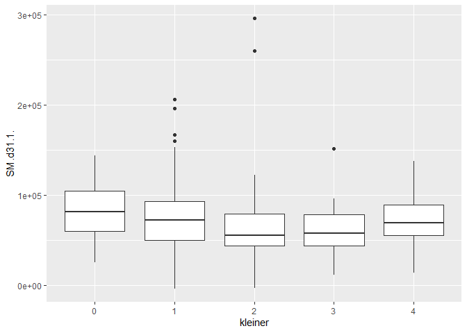

Assessment of Approaches to Computing Analysis of Covariance (ANCOVA)
================
Tommi Suvitaival, <tommi.raimo.leo.suvitaival@regionh.dk>, Steno
Diabetes Center Copenhagen
2019-10-04

# Prepare Data

``` r
load( file = "P:/Klinisk Forskning/Lukkede Mapper/SysMedCode/example_data/GA-lip-190627.RData")

dependent.variable <- "SM(d31:1)"

independent.variables <-
  c(
    "kleiner",
    "age", 
    "bmi", 
    "gender",
    "hba1c", 
    "sbp",
    "abstinent"
  )

tmp <-
  apply(
    X = 
      !is.na( 
        data[ , c( dependent.variable, independent.variables ) ]
      ),
    MAR = 1,
    FUN = all
  )

data.model <- 
  data.frame( 
    data[ tmp, , drop = FALSE ],
    stringsAsFactors = FALSE
  )

data.model[ , independent.variables[ 1 ] ] <-
  factor( data.model[ , independent.variables[ 1 ] ] )

independent.variables <- make.names( independent.variables )

dependent.variable <- make.names( dependent.variable )
```

# Original-Independent-Variables Approach

``` r
options( contrasts = c( 'contr.sum', 'contr.sum' ) )

model.all <-
  lm(
    formula = 
      paste(
        dependent.variable,
        " ~ ",
        paste( 
          independent.variables,
          collapse = " + "
        )
      ),
    data = data.model
  )

anova( object = model.all )
```

    ## Analysis of Variance Table
    ## 
    ## Response: SM.d31.1.
    ##            Df     Sum Sq    Mean Sq F value    Pr(>F)    
    ## kleiner     4 1.1832e+10 2.9581e+09  2.2844 0.0609944 .  
    ## age         1 3.9886e+09 3.9886e+09  3.0803 0.0805333 .  
    ## bmi         1 6.0668e+08 6.0668e+08  0.4685 0.4943325    
    ## gender      1 1.4528e+10 1.4528e+10 11.2200 0.0009408 ***
    ## hba1c       1 2.2566e+09 2.2566e+09  1.7427 0.1880651    
    ## sbp         1 5.9515e+08 5.9515e+08  0.4596 0.4984597    
    ## abstinent   1 1.4851e+10 1.4851e+10 11.4688 0.0008279 ***
    ## Residuals 238 3.0818e+11 1.2949e+09                      
    ## ---
    ## Signif. codes:  0 '***' 0.001 '**' 0.01 '*' 0.05 '.' 0.1 ' ' 1

``` r
car::Anova( mod = model.all, type = 2 )
```

    ## Anova Table (Type II tests)
    ## 
    ## Response: SM.d31.1.
    ##               Sum Sq  Df F value    Pr(>F)    
    ## kleiner   1.0103e+10   4  1.9506 0.1028171    
    ## age       5.7575e+09   1  4.4464 0.0360202 *  
    ## bmi       1.7855e+09   1  1.3789 0.2414558    
    ## gender    1.3048e+10   1 10.0768 0.0016995 ** 
    ## hba1c     7.6566e+08   1  0.5913 0.4426796    
    ## sbp       1.5723e+08   1  0.1214 0.7278028    
    ## abstinent 1.4851e+10   1 11.4688 0.0008279 ***
    ## Residuals 3.0818e+11 238                      
    ## ---
    ## Signif. codes:  0 '***' 0.001 '**' 0.01 '*' 0.05 '.' 0.1 ' ' 1

# Deviation-from-the-Grand-Mean Approach

``` r
options( contrasts = c( 'contr.sum', 'contr.sum' ) )

data.deviation <-
  data.model[ , c( dependent.variable, independent.variables ) ]

data.deviation[ , independent.variables[ -1 ] ] <-
  apply(
    X = data.deviation[ , independent.variables[ -1 ] ],
    MAR = 2,
    FUN =
      function( x ) {
        x - mean( x )
      }
  )

model.deviation <-
  lm(
    formula =
      paste(
        dependent.variable,
        " ~ ",
        paste( 
          independent.variables,
          collapse = " + "
        )
      ),
    data = data.deviation
  )

anova( object = model.deviation )
```

    ## Analysis of Variance Table
    ## 
    ## Response: SM.d31.1.
    ##            Df     Sum Sq    Mean Sq F value    Pr(>F)    
    ## kleiner     4 1.1832e+10 2.9581e+09  2.2844 0.0609944 .  
    ## age         1 3.9886e+09 3.9886e+09  3.0803 0.0805333 .  
    ## bmi         1 6.0668e+08 6.0668e+08  0.4685 0.4943325    
    ## gender      1 1.4528e+10 1.4528e+10 11.2200 0.0009408 ***
    ## hba1c       1 2.2566e+09 2.2566e+09  1.7427 0.1880651    
    ## sbp         1 5.9515e+08 5.9515e+08  0.4596 0.4984597    
    ## abstinent   1 1.4851e+10 1.4851e+10 11.4688 0.0008279 ***
    ## Residuals 238 3.0818e+11 1.2949e+09                      
    ## ---
    ## Signif. codes:  0 '***' 0.001 '**' 0.01 '*' 0.05 '.' 0.1 ' ' 1

``` r
car::Anova( mod = model.deviation, type = 2 )
```

    ## Anova Table (Type II tests)
    ## 
    ## Response: SM.d31.1.
    ##               Sum Sq  Df F value    Pr(>F)    
    ## kleiner   1.0103e+10   4  1.9506 0.1028171    
    ## age       5.7575e+09   1  4.4464 0.0360202 *  
    ## bmi       1.7855e+09   1  1.3789 0.2414558    
    ## gender    1.3048e+10   1 10.0768 0.0016995 ** 
    ## hba1c     7.6566e+08   1  0.5913 0.4426796    
    ## sbp       1.5723e+08   1  0.1214 0.7278028    
    ## abstinent 1.4851e+10   1 11.4688 0.0008279 ***
    ## Residuals 3.0818e+11 238                      
    ## ---
    ## Signif. codes:  0 '***' 0.001 '**' 0.01 '*' 0.05 '.' 0.1 ' ' 1

# Covariate-Residuals-Approach

``` r
# 1) Compute model with covariates

model.covariates <- 
  lm(
    formula = 
      paste(
        dependent.variable,
        " ~ ",
        paste( independent.variables[ -1 ], collapse = " + " )
      ),
    data = data.model
  )

# 2) Compute model with the factor and residuals

data.model$"residuals" <- residuals( object = model.covariates )

contrasts.original <- options( "contrasts" )$"contrasts"

options( contrasts = c( 'contr.sum', 'contr.sum' ) )

model.factor <-
  lm(
    formula = 
      paste(
        dependent.variable,
        " ~ ",
        independent.variables[ 1 ],
        "+ residuals"
      ),
    data = data.model
  )

# 3) Compute F-test for the factor

anova( object = model.factor )
```

    ## Analysis of Variance Table
    ## 
    ## Response: SM.d31.1.
    ##            Df     Sum Sq    Mean Sq  F value    Pr(>F)    
    ## kleiner     4 1.1832e+10 2.9581e+09   18.886 1.551e-13 ***
    ## residuals   1 3.0694e+11 3.0694e+11 1959.674 < 2.2e-16 ***
    ## Residuals 243 3.8061e+10 1.5663e+08                       
    ## ---
    ## Signif. codes:  0 '***' 0.001 '**' 0.01 '*' 0.05 '.' 0.1 ' ' 1

``` r
car::Anova( mod = model.factor, type = 2 )
```

    ## Anova Table (Type II tests)
    ## 
    ## Response: SM.d31.1.
    ##               Sum Sq  Df   F value Pr(>F)    
    ## kleiner   4.9377e+08   4    0.7881 0.5339    
    ## residuals 3.0694e+11   1 1959.6738 <2e-16 ***
    ## Residuals 3.8061e+10 243                     
    ## ---
    ## Signif. codes:  0 '***' 0.001 '**' 0.01 '*' 0.05 '.' 0.1 ' ' 1

## Discussion

<https://besjournals.onlinelibrary.wiley.com/doi/full/10.1046/j.1365-2656.2001.00524.x>
- not ANCOVA but “residual index” method (?)

# Figure

``` r
ggplot2::ggplot(
  data = data.model,
  mapping = 
    ggplot2::aes_string(
      x = independent.variables[ 1 ],
      y = dependent.variable
    )
) +
  ggplot2::geom_boxplot()
```

<!-- -->

# SessionInfo

``` r
utils::sessionInfo()
```

    ## R version 3.4.2 (2017-09-28)
    ## Platform: x86_64-w64-mingw32/x64 (64-bit)
    ## Running under: Windows 7 x64 (build 7601) Service Pack 1
    ## 
    ## Matrix products: default
    ## 
    ## locale:
    ## [1] LC_COLLATE=Danish_Denmark.1252  LC_CTYPE=Danish_Denmark.1252   
    ## [3] LC_MONETARY=Danish_Denmark.1252 LC_NUMERIC=C                   
    ## [5] LC_TIME=Danish_Denmark.1252    
    ## 
    ## attached base packages:
    ## [1] stats     graphics  grDevices utils     datasets  methods   base     
    ## 
    ## loaded via a namespace (and not attached):
    ##  [1] Rcpp_0.12.13       bindr_0.1          compiler_3.4.2    
    ##  [4] nloptr_1.0.4       tools_3.4.2        digest_0.6.12     
    ##  [7] lme4_1.1-15        evaluate_0.14      tibble_1.3.4      
    ## [10] nlme_3.1-131       gtable_0.2.0       lattice_0.20-35   
    ## [13] mgcv_1.8-22        pkgconfig_2.0.1    rlang_0.3.4       
    ## [16] Matrix_1.2-11      yaml_2.2.0         parallel_3.4.2    
    ## [19] SparseM_1.77       xfun_0.7           bindrcpp_0.2      
    ## [22] stringr_1.2.0      dplyr_0.7.4        knitr_1.23        
    ## [25] MatrixModels_0.4-1 grid_3.4.2         nnet_7.3-12       
    ## [28] glue_1.2.0         R6_2.2.2           rmarkdown_1.13    
    ## [31] minqa_1.2.4        ggplot2_3.2.0      car_2.1-6         
    ## [34] magrittr_1.5       scales_1.0.0       htmltools_0.3.6   
    ## [37] MASS_7.3-47        splines_3.4.2      assertthat_0.2.0  
    ## [40] pbkrtest_0.4-7     colorspace_1.3-2   labeling_0.3      
    ## [43] quantreg_5.35      stringi_1.1.5      lazyeval_0.2.0    
    ## [46] munsell_0.5.0
